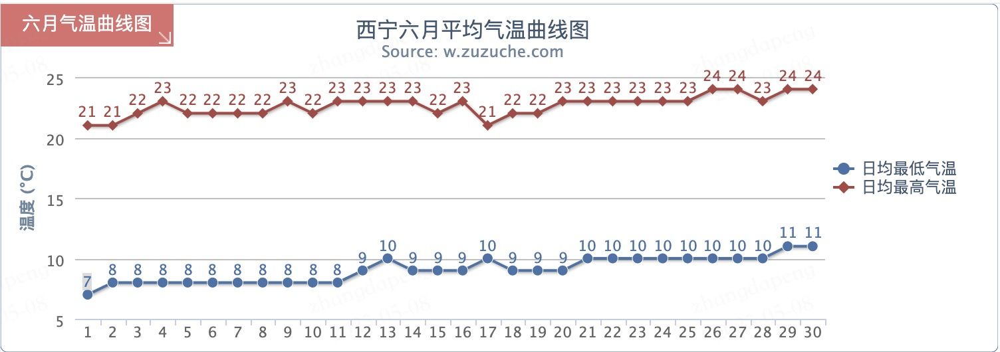

# 时间与天气

## 时间

### 西宁

天亮时间为早上 05:30 左右，天黑时间在 21:00 左右

|日期	|日出	|日中	|日落	|昼长	|天亮	|天黑|
|------|------|------|------|------|------|------|
|2023-06-03 周六	|05:55:13	|13:11:00	|20:26:47	|14:31:34	|05:25:10	|20:56:50
|2023-06-04 周日	|05:54:56	|13:11:10	|20:27:24	|14:32:28	|05:24:50	|20:57:30
|2023-06-05 周一	|05:54:41	|13:11:20	|20:27:59	|14:33:18	|05:24:32	|20:58:08
|2023-06-06 周二	|05:54:28	|13:11:31	|20:28:34	|14:34:06	|05:24:16	|20:58:46
|2023-06-07 周三	|05:54:17	|13:11:42	|20:29:07	|14:34:50	|05:24:02	|20:59:22
|2023-06-08 周四	|05:54:07	|13:11:53	|20:29:40	|14:35:33	|05:23:50	|20:59:57
|2023-06-09 周五	|05:53:59	|13:12:05	|20:30:11	|14:36:12	|05:23:39	|21:00:30
|2023-06-10 周六	|05:53:53	|13:12:17	|20:30:41	|14:36:48	|05:23:31	|21:01:03
|2023-06-11 周日	|05:53:48	|13:12:29	|20:31:10	|14:37:22	|05:23:24	|21:01:33
|2023-06-12 周一	|05:53:45	|13:12:41	|20:31:37	|14:37:52	|05:23:20	|21:02:02
|2023-06-13 周二	|05:53:44	|13:12:54	|20:32:03	|14:38:19	|05:23:17	|21:02:30
|2023-06-14 周三	|05:53:45	|13:13:06	|20:32:28	|14:38:43	|05:23:16	|21:02:56
|2023-06-15 周四	|05:53:47	|13:13:19	|20:32:51	|14:39:04	|05:23:17	|21:03:21
|2023-06-16 周五	|05:53:51	|13:13:32	|20:33:13	|14:39:22	|05:23:20	|21:03:44
|2023-06-17 周六	|05:53:56	|13:13:45	|20:33:33	|14:39:37	|05:23:24	|21:04:05
|2023-06-18 周日	|05:54:04	|13:13:58	|20:33:52	|14:39:48	|05:23:31	|21:04:25
|2023-06-19 周一	|05:54:12	|13:14:11	|20:34:09	|14:39:57	|05:23:39	|21:04:43
|2023-06-20 周二	|05:54:23	|13:14:24	|20:34:25	|14:40:02	|05:23:49	|21:04:59
|2023-06-21 周三	|05:54:35	|13:14:37	|20:34:39	|14:40:04	|05:24:01	|21:05:13
|2023-06-22 周四	|05:54:48	|13:14:50	|20:34:52	|14:40:04	|05:24:14	|21:05:26
|2023-06-23 周五	|05:55:03	|13:15:03	|20:35:03	|14:40:00	|05:24:30	|21:05:36
|2023-06-24 周六	|05:55:20	|13:15:16	|20:35:12	|14:39:52	|05:24:46	|21:05:45
|2023-06-25 周日	|05:55:38	|13:15:29	|20:35:20	|14:39:42	|05:25:05	|21:05:52

## 天气

### 西宁

六月份每天最低气温在10度左右，最高气温在22度左右，昼夜温差大。

